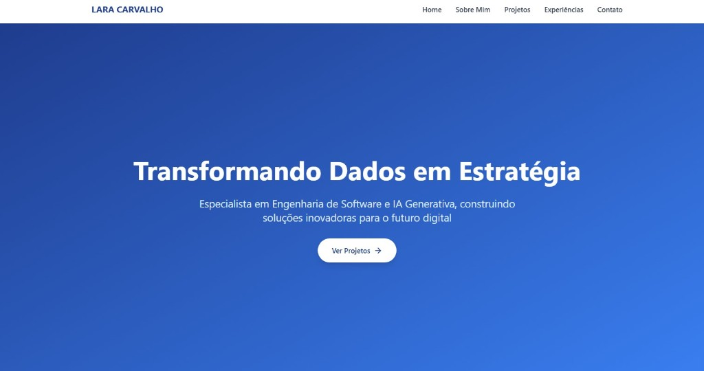
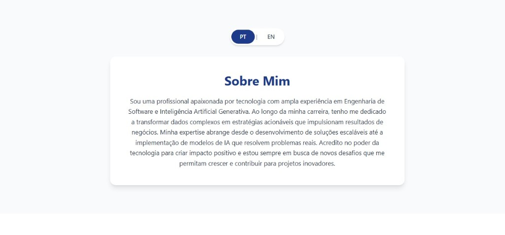
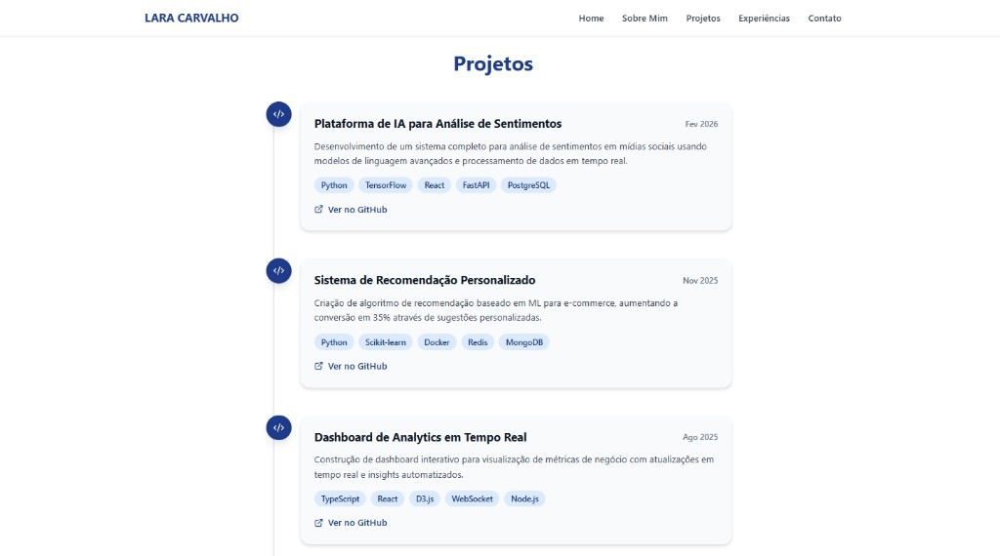
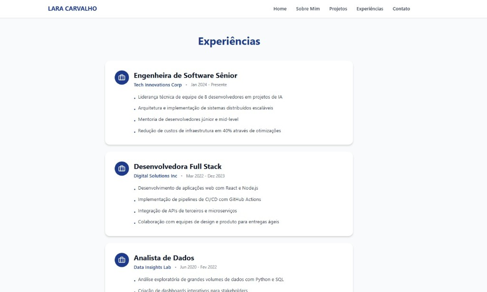
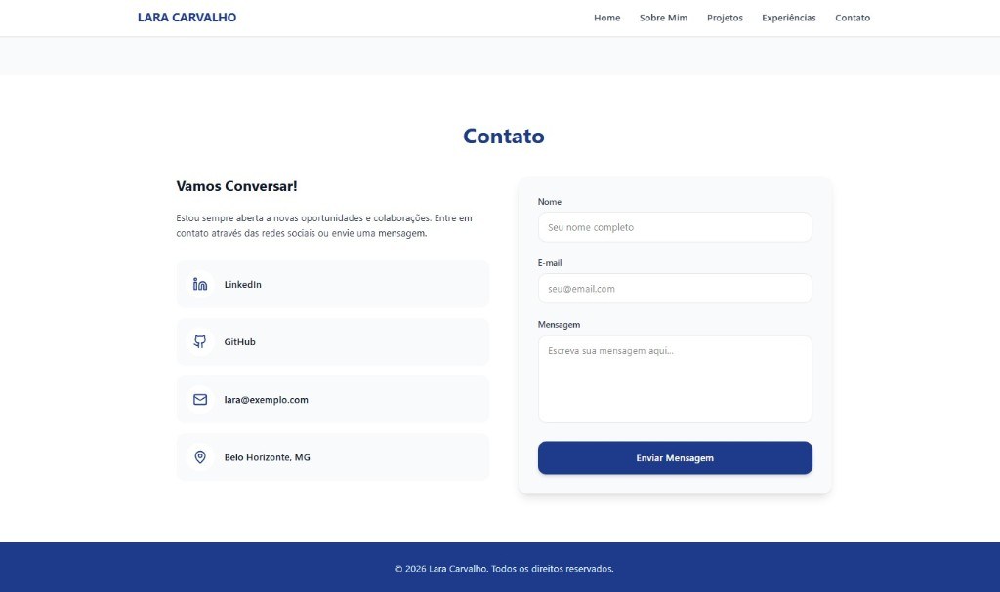

# 🏷️ Portfólio Profissional - Lara Carvalho 👩‍💻

> [!NOTE]
> Este projeto é o desenvolvimento do meu portfólio profissional web. Ele consolida minhas experiências atuando como Product Owner com foco em Inteligência Artificial Generativa, meus desenvolvimentos acadêmicos e meus empreendimentos paralelos. O objetivo é criar uma vitrine tecnológica moderna e responsiva que demonstre minha aptidão para atuar na área de tecnologia e dados.

---

## 🚧 Status do Projeto

    

---

## 📚 Índice
- [Sobre o Projeto](#-sobre-o-projeto)
- [Funcionalidades Principais](#-funcionalidades-principais)
- [Tecnologias Utilizadas](#-tecnologias-utilizadas)
- [Arquitetura](#-arquitetura)
- [Instalação e Execução](#-instalação-e-execução)
- [Personalização](#-personalização)
- [Deploy](#-deploy)
- [Estrutura de Pastas](#-estrutura-de-pastas)
- [Demonstração](#-demonstração)
- [Autores](#-autores)

---

## 📝 Sobre o Projeto
Este projeto foi idealizado inicialmente como requisito acadêmico para o laboratório do curso de Engenharia de Software da PUC-Minas, mas construído com o propósito de se tornar a minha plataforma profissional definitiva. 

Ele resolve a necessidade de centralizar minha trajetória — que transita entre a liderança de produtos (Product Owner), o desenvolvimento focado em IA (Python, IBM Watson, LLMs) e a visão de negócios (como cofundadora da 4 Laços Paperie). O portfólio entrega valor ao apresentar essas habilidades de forma estruturada para recrutadores, parceiros de negócios e a comunidade acadêmica.

---

## ✨ Funcionalidades Principais
As funcionalidades foram divididas em seções acessíveis por um menu de navegação responsivo:

- 🏠 **Home:** Página inicial com foto de perfil e apresentação profissional.
- 👩‍💻 **Sobre Mim:** Apresentação bilíngue (Português/Inglês) com foto e detalhes sobre objetivos profissionais e acadêmicos.
- 🚀 **Projetos:** Linha do tempo dinâmica apresentando projetos acadêmicos, de negócios e de tecnologia, com links para repositórios.
- 💼 **Experiências:** Histórico profissional organizado, destacando atuações em Inteligência Artificial e empreendedorismo.
- 📨 **Contato:** Integração de formulário funcional (via EmailJS) e links rápidos para LinkedIn, GitHub e WhatsApp.
- 🌙 **Tema Automático:** Detecção automática do tema do sistema (dark/light) com opção de alternância manual.

---

## 🛠 Tecnologias Utilizadas

### 💻 Front-end
* **Framework/Biblioteca:** React v18
* **Build Tool:** Vite v5
* **Estilização:** Tailwind CSS v4
* **Roteamento:** React Router Dom v7
* **Ícones:** Lucide React
* **Integração de E-mail:** EmailJS

### 🖥️ Back-end (API de Suporte)
* **Linguagem:** Java 17 (JDK)
* **Framework:** Spring Boot 3.x
* **Build Tool:** Maven

### ⚙️ Infraestrutura & Deploy
* **Hospedagem Front-end:** Vercel
* **Controle de Versão:** Git / GitHub

---

## 🏗 Arquitetura

O sistema segue uma arquitetura baseada em separação de responsabilidades (Client-Server):
1. **Front-end (SPA):** Uma *Single Page Application* em React responsável por toda a interface, roteamento e consumo de serviços.
2. **Back-end (API REST):** Uma API desenvolvida em Spring Boot para fornecer dados dinâmicos estruturados (ex: textos bilingues, lista de projetos) via formato JSON.

---

## 🔧 Instalação e Execução

### Pré-requisitos
* **Java JDK:** Versão 17 ou superior
* **Node.js:** Versão v18.x ou superior
* **Maven:** Versão 3.9.x ou superior (ou use o wrapper `mvnw`)

### 🔑 Variáveis de Ambiente

Crie um arquivo **`.env.local`** na raiz da pasta `/frontend` para a configuração do formulário de contato e da API:

```env
VITE_API_URL=http://localhost:8080/api
VITE_EMAILJS_SERVICE_ID=seu_service_id_aqui
VITE_EMAILJS_TEMPLATE_ID=seu_template_id_aqui
VITE_EMAILJS_PUBLIC_KEY=sua_public_key_aqui
```

> 💡 **Dica:** Copie o arquivo `.env.example` e renomeie para `.env.local`, preenchendo suas credenciais do EmailJS.

### ▶️ Executando o Front-end

```bash
# Acesse a pasta do frontend
cd frontend

# Instale as dependências
npm install

# Inicie o servidor de desenvolvimento
npm run dev
```

O frontend estará disponível em: `http://localhost:5173`

### ▶️ Executando o Back-end

```bash
# Acesse a pasta do backend
cd backend

# Execute com o Maven Wrapper (Windows)
./mvnw.cmd spring-boot:run

# Ou no Linux/Mac
./mvnw spring-boot:run
```

O backend estará disponível em: `http://localhost:8080`

---

## 🎨 Personalização

### 📸 Foto de Perfil

Para adicionar sua foto de perfil:

1. Salve sua foto em `frontend/src/assets/foto-perfil.jpg`
2. Edite os arquivos `Home.jsx` e `Sobre.jsx`:

```javascript
// Altere a linha:
const PROFILE_PHOTO = null;

// Para:
import profilePhoto from '../assets/foto-perfil.jpg';
const PROFILE_PHOTO = profilePhoto;
```

**Ou use uma URL externa:**
```javascript
const PROFILE_PHOTO = 'https://url-da-sua-foto.jpg';
```

### 🌙 Tema Dark/Light

O portfólio possui tema automático que:
- **Detecta automaticamente** a preferência do sistema operacional
- **Permite alternância manual** via botão no header (ícone sol/lua)
- **Persiste a preferência** do usuário no `localStorage`

---

## 🚀 Deploy

### Front-end (Vercel)

1. Faça push do código para o GitHub
2. Conecte o repositório na [Vercel](https://vercel.com)
3. Configure as variáveis de ambiente na dashboard da Vercel
4. O deploy será automático a cada push na branch `main`

### Back-end

O backend pode ser hospedado em serviços como:
- Railway
- Render
- Heroku
- AWS Elastic Beanstalk

---

## 📁 Estrutura de Pastas

```
portfolio-profissional/
├── frontend/
│   ├── src/
│   │   ├── assets/
│   │   │   └── foto-perfil.jpg    # Sua foto de perfil
│   │   ├── pages/
│   │   │   ├── Home.jsx           # Página inicial
│   │   │   ├── Sobre.jsx          # Sobre mim (bilíngue)
│   │   │   ├── Projetos.jsx       # Timeline de projetos
│   │   │   ├── Experiencias.jsx   # Experiências profissionais
│   │   │   └── Contato.jsx        # Formulário de contato
│   │   ├── App.jsx                # Componente principal + tema
│   │   ├── main.jsx               # Entry point
│   │   └── index.css              # Estilos globais + dark mode
│   ├── .env.example               # Template de variáveis de ambiente
│   ├── .gitignore
│   ├── package.json
│   ├── vite.config.js
│   └── tailwind.config.js
├── backend/
│   ├── src/
│   │   └── main/
│   │       ├── java/com/portfolio/api/
│   │       │   └── ApiApplication.java
│   │       └── resources/
│   │           └── application.properties
│   ├── pom.xml
│   └── mvnw / mvnw.cmd
└── README.md
```

---

## 🎬 Demonstração

### 🖥️ Páginas

| Home | Sobre Mim |
|------|-----------|
|  |  |

| Projetos | Experiências |
|----------|--------------|
|  |  |

| Contato |
|---------|
|  |

---

## 👥 Autores

| Foto | Nome | Contato |
|------|------|---------|
|  | **Lara Andrade Carvalho** | [](https://linkedin.com/in/seu-perfil) [](https://github.com/LaraCarvalho00) |

---

## 📄 Licença

Este projeto está sob a licença MIT. Consulte o arquivo [LICENSE](LICENSE) para mais detalhes.
